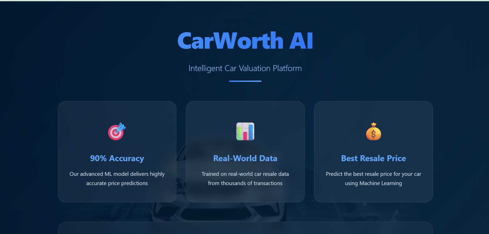
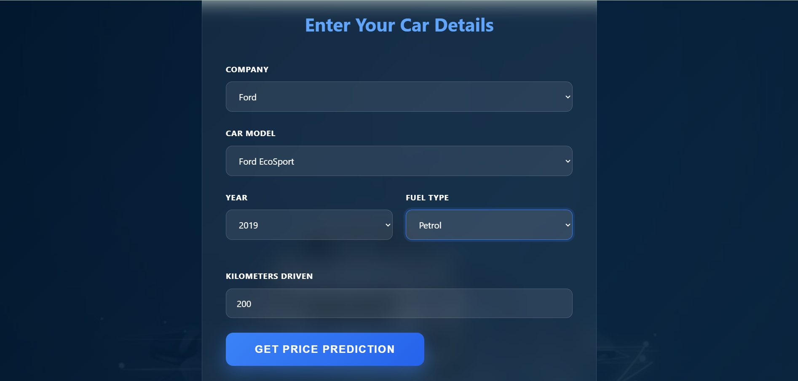

# 🚗 CarWorth AI – Car Price Prediction System

CarWorth AI is a Machine Learning–based web application that predicts the **resale price of a car** using real-world data.  
By analyzing factors such as car brand, model, fuel type, year of manufacture, and kilometers driven, the system provides a **fair and data-driven price estimate** for used cars.

This project combines data preprocessing, machine learning, and a clean web interface to deliver reliable price predictions.

---

# Key Features

- Instant car resale price prediction  
- Trained on real-world used car data  
- ~90% prediction accuracy  
- Optimized Linear Regression model  
- Clean and user-friendly web UI  

---

# Machine Learning Overview

- Algorithm Used: Linear Regression  
- Model Optimization: Hyperparameter tuning  
- Accuracy Achieved: ~90%  

# Why Linear Regression?
- Works well for continuous price prediction  
- Easy to interpret and explain  
- Efficient and reliable for structured tabular data  

---

# Data Cleaning & Preprocessing

Real-world car resale data contained missing, inconsistent, and non-numeric values. The following preprocessing steps were applied to improve data quality and model performance:

- **Year:** Removed non-numeric values and converted the column to integer.
- **Price:** Removed rows with `"Ask For Price"`, eliminated commas, and converted prices to integers.
- **Kilometers Driven:** Extracted numeric values, removed invalid entries, and converted to integer format.
- **Fuel Type:** Removed rows with missing fuel type values.
- **Car Name:** Standardized names by keeping only the first three words.

Final dataset: 816 rows × 6 columns

The cleaned dataset was then encoded and used for training the ML model.

# Web Application Overview

The web application allows users to input car details such as:
* Company
* Car Model
* Manufacturing Year
* Fuel Type
* Kilometers Driven

Upon submission, the trained ML model predicts the best possible resale price.

# Screenshots

Home page 

# Car Details Form

---

# Tech Stack

* Language: Python
* Machine Learning: Scikit-learn
* Algorithm: Linear Regression
* Frontend: HTML, CSS
* Backend: Flask
* Libraries: NumPy, Pandas, Scikit-learn, Pickle

---

# Conclusion

CarWorth AI demonstrates how effective data cleaning combined with a well-optimized Machine Learning model can deliver accurate and practical car resale price predictions through a simple and user-friendly web application.
